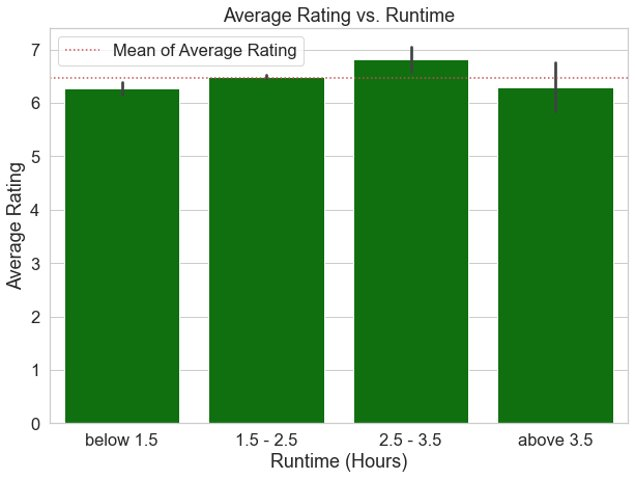
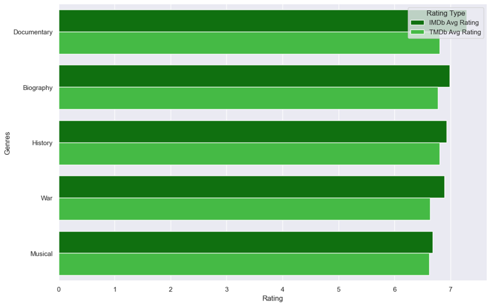

# AI Academy Semester 1 Capstone - Group 5 (Fab Five)

## Overview
In our semester 1 capstone project, we have developed three key recommendations to provide to our stakeholder, Computing Vision, in order to help them create movies that will achieve success for their new movie studio in terms of high ratings and high profits. To form our recommendations, we cleaned and combined multiple datasets containing movie-related data for a variety of movies across multiple time periods. All of these datasets were merged to create one master dataset containing 3122 movies. We performed exploratory data analysis and statistical testing on this master dataset to gain a better understanding of how a movie can be successful. Our analysis and recommendations focus on three key factors of a movie: runtime, genre, and budget.

## Business Understanding

### Stakeholder: Computing Vision
The stakeholder is starting a new movie studio and has limited to no experience in the field.
### Some business questions: 
1. What is their starting budget? (Do they have money to pay for top actors and directors?) 
2. What are top performing genres? 
3. What is the profitability of producing films with high budgets? 
4. What movie runtime has highest ratings/profitability

## Data Understanding
The data used in this analysis is box office movies, IMDb, and TMDb. These were analysied to determine the highest rated and most profitable moveies based on runtime, genre, and budget. 

### Source of Data
To create our master dataframe, we used data from four different sources within the zippedData folder. These sources include:
1. IMBd (im.db.zip)
2. TMDb (tmdb.movies.csv.gz)
3. The Numbers (tn.movie_budgets.csv.gz)
4. Box Office Mojo (bom.movie_gross.csv.gz)

After combining and cleaning these datasets into one, we created our master dataframe. Our master dataframe includes the following:
- 3,122 rows
- 12 columns

### Description of Data
The master dataframe we created is used to represent the overall population. The index for the dataframe is "movie" which indicates that each row is organized based on movie. We decided to use the following columns in our master dataframe: studio, domestic_gross, foreign_gross, year, release_date, production_budget, worldwide_gross, averagerating, numvotes, runtime_minutes, genres, and total_profit. Please see below for a description of the columns in our master dataframe:

- studio: the film studio that made the film
- domestic_gross: box office figures (in $) representing United States and Canada
- foreign_gross: box office figures (in $) not in the US or Canada
- year: the year representing a movie's respective domestic/foreign gross
- release_date: the date the film was released
- production_budget: the budget that is estimated to be the costs that are incurred from producing a film (in $)
- worldwide_gross: box office figures (in $) worldwide
- averagerating: average rating from a scale of 1-10
- numvotes: number of votes that is associated with the rating for a film
- runtime_minutes: duration of the film in minutes
- genres: genre/category of a film
- total_profit: difference between worldwide_gross and production budget (in $)

### Three Visualizations
This chart shows how the duration of a film relates with its total profit. In this case, the 2.5-3.5 hour range appears to be best in terms of overall revenue.

Below the average overall rating for each movie genre on both IMDb and TMDb is displayed. Generally, most genres are rated around the same with the exception of nonfiction films.

This scatterplot shows the relation between profit percentages and production budgets. Films with smaller budgets typically appear to have higher profit percentages in comparison to higher budget films.

## Statistical Communication:
Following our exploratory data analysis of profit percentage (total profit/production budget * 100) we found that the means of 5 genres seemingly were higher than the population mean, so we decided to run statistical testing to see if this change is significant. 
Because we are taking samples of the population (the 5 genres) and comparing it to the total population in our dataset (overall movies), we decided on running one tail t-tests to determine if these result were significant.

### Results:

Population Profit Average: 397.5%

Horror Profit% Average:   1233.1%   T-stat: 3.54 (p<0.001)     Confidence Interval: -100% - 7744.7% 

Mystery Profit% Average:  1047.7%   T-stat: 2.01 (p<0.05)      Confidence Interval: -100% - 8414.8%

Sport Profit% Average:    1093.1%   T-stat: 2.25 (p<0.05)      Confidence Interval: -100% - 5243.5% 

Thriller Profit% Average:  733.7%   T-stat: 2.27 (p<0.05)      Confidence Interval: -100% - 5855.7% 

Romance Profit% Average:   566.8%   T-stat: 2.44 (p<0.05)      Confidence Interval: -100% - 2525.8%

### Interpretation:
Our null hypothesis for each test was that each genre's average profit percentage was less than or equal to the population mean.
Our alternate hypothesis for each test was that each genre's average profit percentage was greater than the population mean. 
In all of our statistical testing we found that the results were significant at an alpha threshold of 0.05. We settled on this alpha threshold to limit the amount of possible type I or type II errors that we could encounter.

These results allow us to reject our null hypothesis and say that these five genres have a significantly higher average profit percentage as compared to the general population of movies. 

The range in which we believe these true value of these genre's average profit percentage is listed in the above confidence intervals. 

## Conclusions
### To review, four datasets were cleaned and combined for analysis.
The duration of the films in the dataset were analyzed and compared with rating, profits, and genre. Results from the analysis showed that films between 2.5 and 3.5 hours would produce the best ratings. In addition, films between 0.5 and 1.5 hours would produce the best profit percentages. The average runtime of each genre was generally very similar with only minor variations.

The genres of the movies were correlated with profits and the ratings from both the IMDb and TMDb databases. Results revealed that nonfiction genres such as history, documentary, and biography were rated the highest above all other genres. The most popular sub-genres for these films included war, musical, and animation among others. However, action-packed genres such as horror, thriller, and mystery appeared to have the highest profit margins.

Finally, the budgets and profits of films were analyzed in connection with ratings and profits. While there was some minor positive correlation between budget and ratings, many lower budget films performed just as well in terms of both ratings and profit margins. Additionally, film runtime was found to be proportional to budget, with longer movies costing more to make. In connection with the duration analysis, the best choice would be to produce a lower budget film (which would inherently have a shorter runtime) for greater profits. Otherwise, if high ratings take precedence, a longer high budget film would be a better choice.

### Provided the previous data analysis, the best option moving forward would be to produce a longer form film with a small budget.
If the end goal is profit, a low-budget, short, scary/action-packed film would maximize potential profits. Otherwise, if building the studio's reputation is more of a priority, a high-budget, longer, nonfiction movie would increase the probability of higher ratings.
